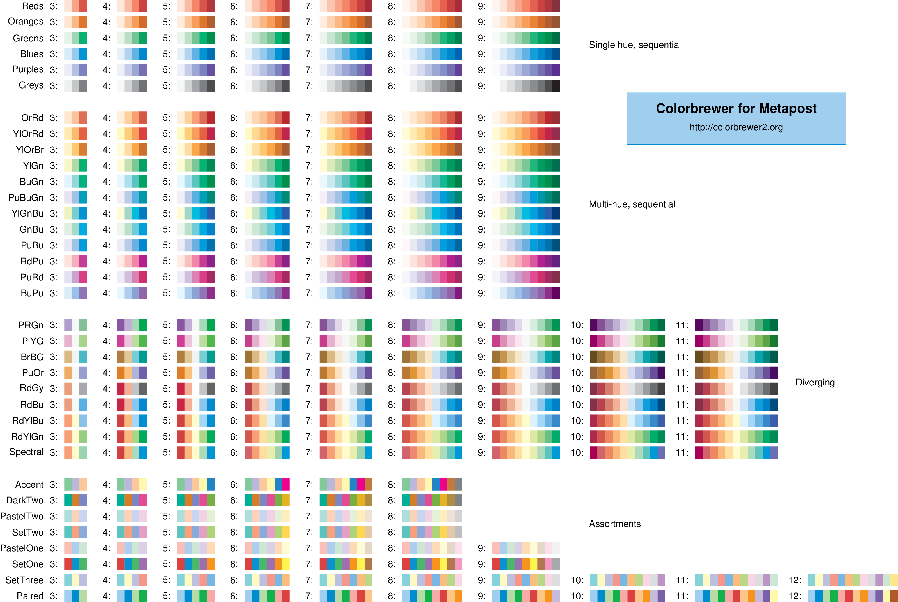

# metapost-colorbrewer

An implementation of the colour palettes from Colorbrewer2.org for Metapost

Toby Thurston -- 16 May 2018 

Provides

- A Python script that reads "cb.csv" from https://github.com/axismaps/colorbrewer/
  and creates a Metapost include-file that includes all the Colorbrewer definitions as 
  Metapost colors (cmyk or rgb, as you please)

- colorbrewer-cmyk.mp
- colorbrewer-rgb.mp
- colorbrewer-sampler.mp

